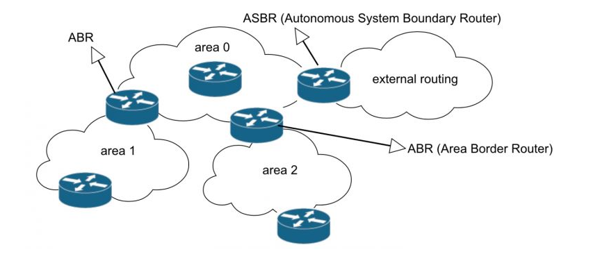
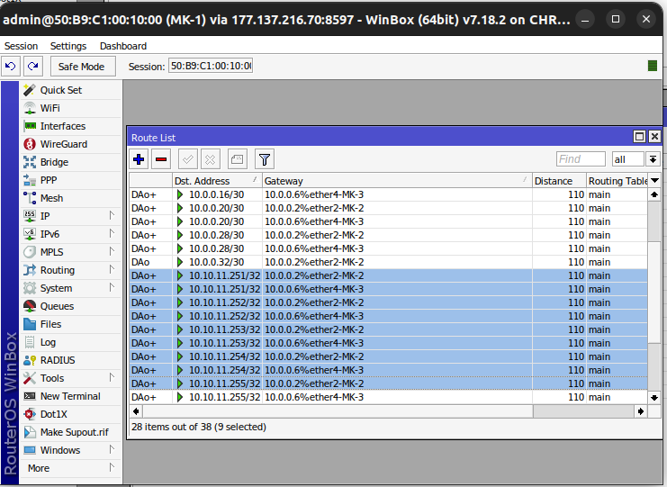
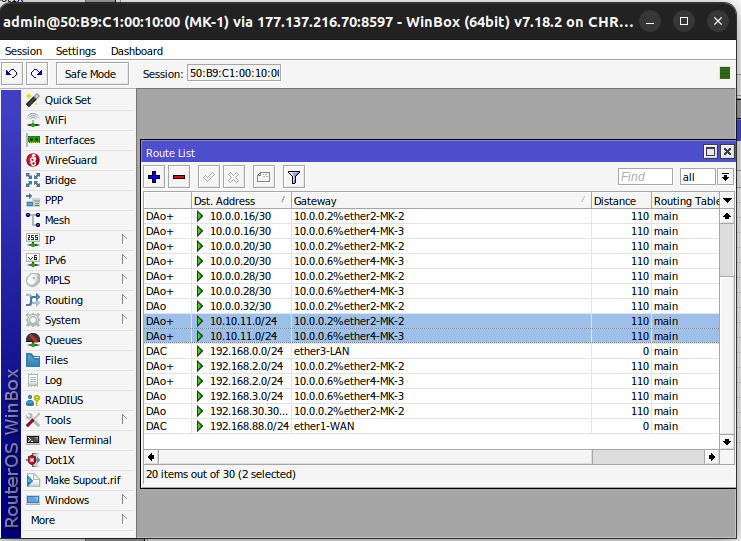

# OSPF

## How does OSPF works ? 
OSPF is a link-state protocol, which means that each router in the network maintains a database describing the state of each interface in the network. This database is called `LSDB` (Link State Database ) and contains information such as: 

- The `router ID` of each router in the network
- The ip addresses and subnet of each interface
- The `cost` metric of each interface
- The `type` and `state` of each interface
- The neighbor on each interface

Each router in network sends out `link-state advertisements ` or `LSAs` to the neighbors, which contain the inforation  `LSDB` router. Each neighbor receives LSAs from others routers and sharing your LSAs with other routers, this process is called `link-state synchronization`. Using the infomation from LSDB, each router can calculates the best path to each destination using a shortest path algorithm (`Such as Dijkstra's algorithm`). the best path is based on cost of each link, which can be configured manually on route or for other factors such as bandwidht, delay and time load. The result after calculate is stored in routing table with the next hop router and interface for each destination.

## How the OSPF calculate the Cost ? 

The OSPF assigns a **Default Cost** to each interface based on its **Bandwitch**.

| Interface  type          | Bandwitch | OSPF Cost |
|-------------------------------|------------------|-------------|
| Gigabit Ethernet (1 Gbps)     | 1000 Mbps        | 1           |
| Fast Ethernet (100 Mbps)      | 100 Mbps         | 1           |
| Ethernet (10 Mbps)            | 10 Mbps          | 10          |
| DS1 (1.544 Mbps)              | 1.544 Mbps       | 64          |
| DSL (768 Kbps)                | 0.768 Mbps       | 133         |

OSPF Calculate the **best path** by adding up the cost of each hop.

## OSPF Areas

### Backbone Area
Or area 0.0.0.0 is the main Area and serving as central point of connections other areas. It distributes routing informations beteween non-backbones area types.

### Standart Area
Any area diferent 0, it can only connect to the backbone area or another standar area through an `ABR` (Area Backbone router)

### Stub Area
The stub area you don't receive external routes, the `LSAs` type 5 and that incluse.

- Redistribution Static route
- Redistribution BGP
- Any external route of ospf

## Totaly stub area 
The area she don't receive routes type 

- `LSA type 3`:  Bloked route from any other areas 
- `LSA Type 5`:  Bloqued externar route from `asbr`
- Redistribution Static route
- Redistribution BGP
- Any external route of ospf 

## NSSA Area
This area is equal to Totaly stub / Stub unique diference is in the area NSSA you can inject static route to area backbone back.
Example, you have two areas such as:
- `Backbone`: 0.0.0.0
- `NSSSA`: 0.0.0.1

Inside the NSSA area, you can be learning the ospf routes equal to totally stub or stuby, blocking LSAs type 3 and type 5. But the difference is you can insert route static from NSSA area to Area backbone. This area normally don't more used, but is good you learning it. 

# OSPF Broadcast
In the broadcast network its necessary was a DR and BDR

## DR (Designeted Router) 
### `224.0.0.5` All routes 
When the DR or BDR to need comunicate with all router, he used the broadcast band `224.0.0.5` for you to comunicate 

### `224.0.0.6` just DR and BDR
When an router in broadcast network need to comunicate with DR ou BDR, he used the broadcast band `224.0.0.6` for to comunitcate with DR or BDR

## BDR (Backup Designeted Router)
How the name said he is the backup from DR

## Election DR and BDR
- More priority 
- Priority 0 never has to Elected
- If priority equal or bigger from RouterID
- If undefined Router ID he used minor active ip 
- 255 Bigger value priority 

# OSPF Point to point
In Point to point network dont have make sense to election DR an BDR because it is link beetwen two routers. So because it we dont have form adjacency with every routers just with the router at link.

# Type Routers

## ASBR (Autonomous System Boundary Router)
This router connect an area with outher ASN and possibly sharing default route. 

## BR (Border Router)
This router is entirely in the backbone area

## ABR (Area Border Router)
Connect with outher border

# Area ranges 

In the area range we can see this example

This example we have the area  PPPoE server with the ip range  `10.10.11.0/24`  your gateway is the MK6 where i am sharing the ip range address on ospf `Area-1`. But wiht it we have a problem, because if i see on my MK-1 we has the /32 routes about our pppoe server. 

We create 9 routes on ospf routing table of clientes, it is only  five clientes, imagin an ISP with two thousen clients. 

### Solving the problem

For this we can crete the area range on MK4 our `ASBR` <>Area-0 < > Area-1`<>  filtering the range IP for sharing on OSPF routing table. 

### How it Was on MK-1  

We did the routes be only a route, Saving the route on routing table.

 