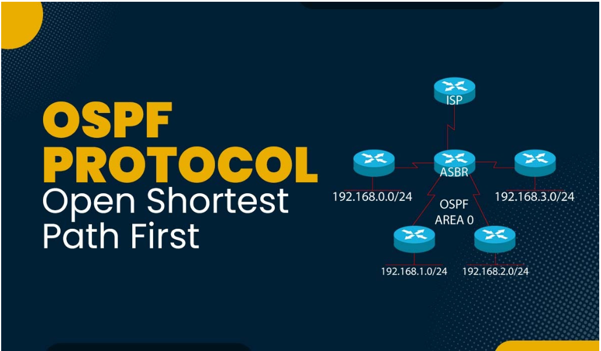
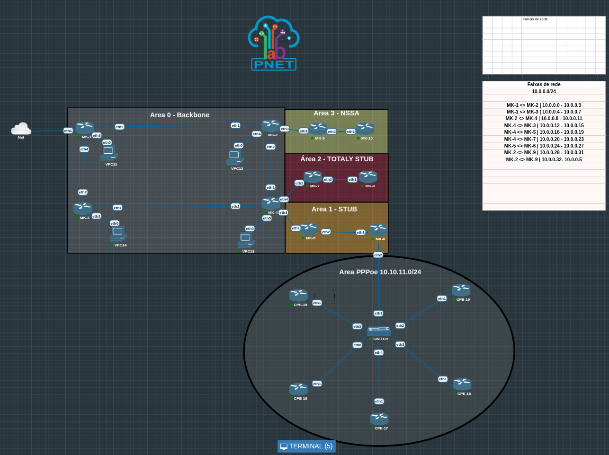

# OSPF



---

## How does OSPF works ? 

OSPF is a link-state protocol, which means that each router in the network maintains a database describing the state of each interface in the network.  
This database is called `LSDB` (Link State Database ) and contains information such as: 

- The `router ID` of each router in the network  
- The ip addresses and subnet of each interface  
- The `cost` metric of each interface  
- The `type` and `state` of each interface  
- The neighbor on each interface  

Each router in network sends out `link-state advertisements` or `LSAs` to the neighbors, which contain the inforation `LSDB` router.  
Each neighbor receives LSAs from others routers and sharing your LSAs with other routers, this process is called `link-state synchronization`.  

Using the infomation from LSDB, each router can calculates the best path to each destination using a shortest path algorithm (`Such as Dijkstra's algorithm`).  
The best path is based on cost of each link, which can be configured manually on route or for other factors such as bandwidht, delay and time load.  
The result after calculate is stored in routing table with the next hop router and interface for each destination.

---

## How the OSPF calculate the Cost ? 

The OSPF assigns a **Default Cost** to each interface based on its **Bandwitch**.

| Interface type               | Bandwitch  | OSPF Cost |
|-------------------------------|-------------|------------|
| Gigabit Ethernet (1 Gbps)     | 1000 Mbps   | 1          |
| Fast Ethernet (100 Mbps)      | 100 Mbps    | 1          |
| Ethernet (10 Mbps)            | 10 Mbps     | 10         |
| DS1 (1.544 Mbps)              | 1.544 Mbps  | 64         |
| DSL (768 Kbps)                | 0.768 Mbps  | 133        |

OSPF Calculate the **best path** by adding up the cost of each hop.

---

## OSPF Areas


### Backbone Area

Or area `0.0.0.0` is the main Area and serving as central point of connections other areas.  
It distributes routing informations beteween non-backbones area types.

### Standart Area

Any area diferent `0`, it can only connect to the backbone area or another standar area through an `ABR` (Area Backbone router)

### Stub Area

The stub area you don't receive external routes, the `LSAs` type 5 and that incluse.

- Redistribution Static route  
- Redistribution BGP  
- Any external route of ospf  

### Totaly stub area 

The area she don't receive routes type:  

- `LSA type 3`:  Bloked route from any other areas  
- `LSA Type 5`:  Bloqued externar route from `asbr`  
- Redistribution Static route  
- Redistribution BGP  
- Any external route of ospf  

### NSSA Area

This area is equal to Totaly stub / Stub unique diference is in the area NSSA you can inject static route to area backbone back.  

Example, you have two areas such as:  
- `Backbone`: 0.0.0.0  
- `NSSSA`: 0.0.0.1  

Inside the NSSA area, you can be learning the ospf routes equal to totally stub or stuby, blocking LSAs type 3 and type 5.  
But the difference is you can insert route static from NSSA area to Area backbone.  
This area normally don't more used, but is good you learning it.  

---

# OSPF Broadcast

In the broadcast network its necessary was a DR and BDR

## DR (Designeted Router) 

### `224.0.0.5` All routes 

When the DR or BDR to need comunicate with all router, he used the broadcast band `224.0.0.5` for you to comunicate.  

### `224.0.0.6` just DR and BDR

When an router in broadcast network need to comunicate with DR ou BDR, he used the broadcast band `224.0.0.6` for to comunitcate with DR or BDR.

---

## BDR (Backup Designeted Router)

How the name said he is the backup from DR

---

## Election DR and BDR

- More priority  
- Priority 0 never has to Elected  
- If priority equal or bigger from RouterID  
- If undefined Router ID he used minor active ip  
- 255 Bigger value priority  

---

# OSPF Point to point

In Point to point network dont have make sense to election DR an BDR because it is link beetwen two routers.  
So because it we dont have form adjacency with every routers just with the router at link.

---

# Type Routers


## ASBR (Autonomous System Boundary Router)

This router connect an area with outher ASN and possibly sharing default route. 

## BR (Border Router)

This router is entirely in the backbone area.

## ABR (Area Border Router)

Connect with outher border.

---

# Area ranges 

In the area range we can see this example:



This example we have the area PPPoE server with the ip range `10.10.11.0/24` your gateway is the MK6 where i am sharing the ip range address on ospf `Area-1`.  
But wiht it we have a problem, because if i see on my MK-1 we has the /32 routes about our pppoe server. 


We create 9 routes on ospf routing table of clientes, it is only five clientes, imagin an ISP with two thousen clients.  

---

### Solution: Use area Ranges (Summarization)

For this we can crete the area range on MK4 our `ASBR` <>Area-0 < > Area-1`<> filtering the range IP for sharing on OSPF routing table. 

---

### How it Was on MK-1  


We did the routes be only a route, Saving the route on routing table.


# Tuneis VPN

## EOIP
This protocol is a protocol Layer Two owener  Mikrotik Router OS Owner, based on RFC 1701. This protocol we can intercconect two points how an cable LAN interconnect two lan networks and we can add this protocol a bridge network.


The eoip  protocol usualy uses the IpIp protocol or pptp for connect with other router, how shuch as in image above. 

### in our Lab


We can close VPN beteween MK1 and MK2 using the eoip protocol.

Config in MK1 <> MK2


`Name`: eoip-tunel
`MTU`: 1500 
`Remote Addr`: 192.168.88.146 (The MK2)
`Tunel-ID`: 10 (Type on area id on OSPF)  
`IP-Secret`: For encrypt the connetion 

For create in the terminal: 

```less
/interface eoip add name="eoip-main" tunnel-id=0 remote-address=10.0.0.1 disabled=no

```

The packet on wireshark with no ipsec


We can see all packets data, so uses the Eoip with no ipsec is a insecure protocol.


Uses the Ip-Sec all  packets will be encrypt. 


### PPTP

PPTP is not a secure protocol, don't acept any security config  for encrypt the Data. Is a layer 3 protocol and is the Protocol client-to-side and side-to-side. 


## PPTP Server:

Enable service
```less
interface/pptp-server/server/set enabled=yes
```

Create the secret

```less
ppp/secret/add local-address=10.0.0.1 name=user1 password=12345 profi
le=default-encryption remote-address=10.0.0.5 service=pptp
```

- `Local-addresses`: Local Adresses VPN Server
- `Remote-adresses`: Cliente local adresses on VPN


## PPTP Client

Create  the client

```less
 interface pptp-client add connect-to=192.168.88.2 disabled=no name=pptp-out1 password=12345 user=user1

```

```less
[admin@R2] > interface/pptp-client/print 
Flags: X - disabled; R - running 
 0  R ;;; PPTP connections are considered unsafe, it is suggested to use a more >
ern VPN protocol instead
      name="ppp-client-MK1" max-mtu=1450 max-mru=1450 mrru=disabled 
      connect-to=192.168.88.147 user="user1" password="12345" 
      profile=default-encryption keepalive-timeout=60 use-peer-dns=no 
      add-default-route=no dial-on-demand=no allow=pap,chap,mschap1,mschap
```


### SSTP
Layer 3 protocol this tunnel is close on port 443 so this protocol has an Grear mobility becase imagine if you need access an VPN in the airport, usualy the firewalls block the most port VPN in your lan network, but the port 444 the  firewall can't block the port https 443. 


#### Create
```
interface/sstp-server/server/set enabled=yes default-profile=default-
encryption  
```

Show

```less
[admin@R1] > interface/sstp-server/server/print 
                    enabled: yes               
                       port: 443               
                    max-mtu: 1500              
                    max-mru: 1500              
                       mrru: disabled          
          keepalive-timeout: 60                
            default-profile: default-encryption
             authentication: pap               
                             chap              
                             mschap1           
                             mschap2           
                certificate: none              
  verify-client-certificate: no                
                        pfs: no                
                tls-version: any               
                    ciphers: aes256-sha        
                             aes256-gcm-sha384 
[admin@R1] > 

```

Client secret

```less
[admin@R1] > ppp/secret/add local-address=10.0.0.2 remote-address=10.0.0.6 name=ss
tp-mk2 password=12345 profile=default-encryption
```

### Client server

Create

```less
[admin@MikroTik > interface sstp-client add connect-to=192.168.88.147 disabled=no name=sstp-out1 password=123456 profile=default-encryption user=sstp-mk2

```

Show

```less
[admin@R2] > interface/sstp-client/print 
Flags: X - disabled; R - running; H - hw-crypto 
 0  R  name="sstp-out1" max-mtu=1500 max-mru=1500 mrru=disabled 
       connect-to=192.168.88.147 port=443 http-proxy=:: proxy-port=443 
       certificate=none verify-server-certificate=no 
       verify-server-address-from-certificate=yes user="sstp-mk2" 
       password="12345" profile=default-encryption keepalive-timeout=60 
       add-default-route=no dial-on-demand=no 
       authentication=pap,chap,mschap1,mschap2 pfs=no tls-version=any 
       ciphers=aes256-sha add-sni=no 
[admin@R2] > 

```


# L2TP

L2TP works on port UDP/1701 this protocol for mantain secure we used the IpSec protocol for encrypt all datas.


## For make the Server
```less
[admin@R1] > interface/l2tp-server/server/set enabled=yes

```

Show 

```less
[admin@R1] > interface/l2tp-server/server/print 
                 enabled: yes               
                 max-mtu: 1450              
                 max-mru: 1450              
                    mrru: disabled          
          authentication: pap               
                          chap              
                          mschap1           
                          mschap2           
       keepalive-timeout: 30                
            max-sessions: unlimited         
         default-profile: default-encryption
               use-ipsec: no                
            ipsec-secret:                   
          caller-id-type: ip-address        
    one-session-per-host: no                
         allow-fast-path: no                
       l2tpv3-circuit-id:                   
    l2tpv3-cookie-length: 0                 
      l2tpv3-digest-hash: md5               
  accept-pseudowire-type: all               
    accept-proto-version: all               
[admin@R1] > 
```

Create the user

```less
ppp/secret/add name=l2tp-mk2 password=12345 profile=default-encryptio
n service=l2tp local-address=10.0.0.3 remote-address=10.0.0.10 disabled=no en
```

## L2TP Client

Create

```less
[admin@R2] > interface/l2tp-client/add connect-to=192.168.88.147 name=l2tp-mk2 password=1234
5 profile=default-encryption disabled=no
```

Show

```less
[admin@R2] > interface/l2tp-client/print 
Flags: X - disabled; R - running 
 0  R name="l2tp-mk2" max-mtu=1450 max-mru=1450 mrru=disabled connect-to=192.168.88.147 
      user="l2tp-mk2" password="12345" profile=default-encryption keepalive-timeout=60 
      use-peer-dns=no use-ipsec=no ipsec-secret="" allow-fast-path=no 
      add-default-route=no dial-on-demand=no allow=pap,chap,mschap1,mschap2 
      random-source-port=no l2tp-proto-version=l2tpv2 l2tpv3-digest-hash=md5 
[admin@R2] 
```


